# mgba-splitscreen

> ## 🕹️ [Try it in your browser — no install](https://spuds0588.github.io/mgba-splitscreen/)
>
> The full emulator runs in-browser via WebAssembly: pick a ROM, choose 1–4 linked
> players, and play. (A ROM is required to play; use the **Games Library** or
> **File → Load ROM**.)

> ## ⚠️ [Download test builds — pre-release](https://github.com/Spuds0588/mgba-splitscreen/releases/tag/v0.3.1)
>
> Want to test native builds instead? The latest pre-release has installers for
> **Windows** (`.msi`/`.exe`), **macOS** (`.dmg`, Apple Silicon), **Linux**
> (`.deb`/`.rpm`/`.AppImage`), and **Android** (`.apk`).
>
> **Please read before installing:**
> - These are **beta quality** builds of a hobby project. Expect rough edges, and
>   don't consider them stable. No code signing / no app store — desktop Windows
>   and macOS will show their usual "unrecognized developer" warnings.
> - **Android:** sideload only — enable "Install unknown apps" for your browser or
>   file manager, then open the APK. Grab the **universal** APK for any device
>   (phones, tablets, Android TV) or the smaller **arm64** APK for modern phones.
>   The v0.3.1 APKs were signed with a one-off test key: uninstall that build once
>   before installing v0.3.2 or later, which then upgrade in place.
> - **Crash and issue reports are automatic and public:** the app collects system
>   info, game/ROM name, and a console log tail and files a public GitHub issue
>   (via a prompt you can also open yourself from the pause menu). Nothing else
>   is collected, and no ROM or save data ever leaves your device.
> - Found something broken? [Open an issue](https://github.com/Spuds0588/mgba-splitscreen/issues/new?labels=bug) —
>   tester reports directly drive what gets fixed.

mgba-splitscreen is a **split-screen Game Boy Advance emulator**: run multiple GBA instances
side by side, linked together over a virtual link cable, so two to four players can
play multiplayer GBA games (trading, link battles, co-op, etc.) on a single machine —
each player gets their own screen and their own controls.

It is built on top of the excellent [mGBA](https://mgba.io/) core and is a fork of
[mGBA](https://github.com/mgba-emu/mgba) (`Spuds0588/mgba-splitscreen`), which provides
the emulation engine, accuracy, and the lockstep link-cable synchronization used to keep
the instances in perfect sync.

## Screenshots

Real 4-player sessions captured from the app — four linked instances, one keyboard.

**Mario Kart: Super Circuit — a live 4-player VS race** over the virtual link cable
(single-card Multi-Pak play: three of the screens booted from the host's transfer):

| | |
|---|---|
| 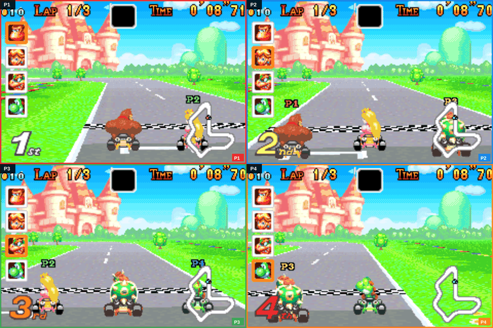 | 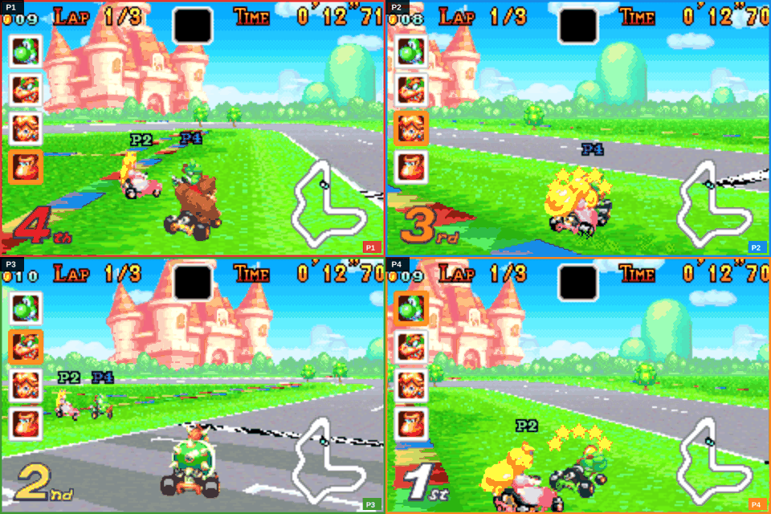 |

The same live race in the **Speaker** and **Overlay (PiP)** view modes — every player
keeps playing no matter how the screens are arranged:

| | |
|---|---|
| 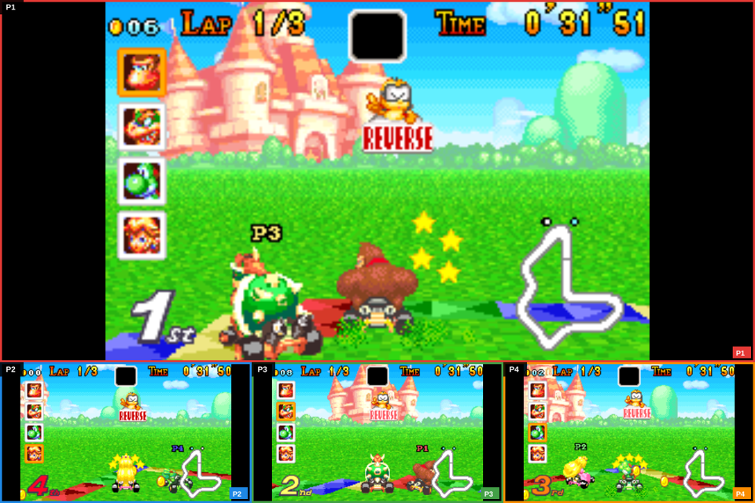 | 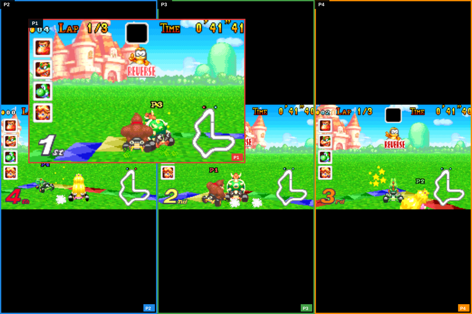 |

**Kirby & The Amazing Mirror — 4-Kirby co-op** (single-card GBA multiplayer): the game
boots its "ADVENTURE WITH 4 KIRBYS!" banner on the linked session and each player gets
their own screen into the shared hub world:

| | |
|---|---|
| 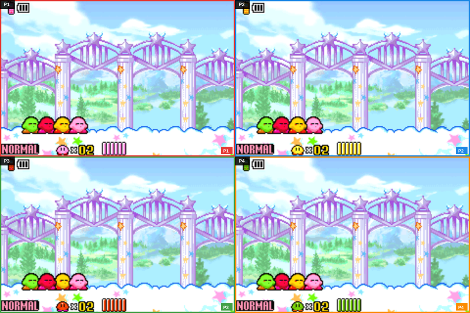 | 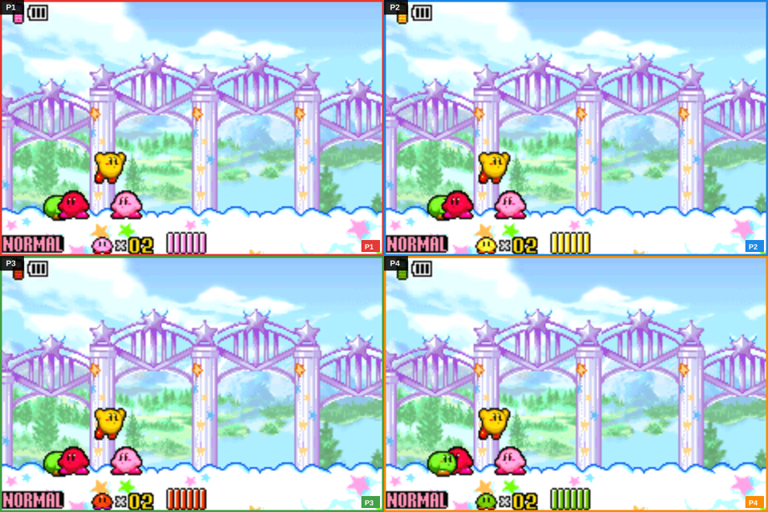 |

A mid-air group jump — each screen shows the same moment from that player's camera:

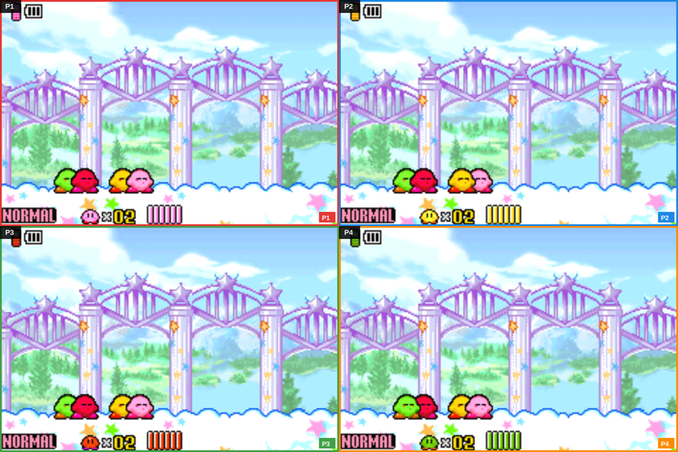

View modes work during play — here the same co-op session in **Speaker**, **Focus**
(one screen full-size) and **Overlay/PiP**:

| | | |
|---|---|---|
| 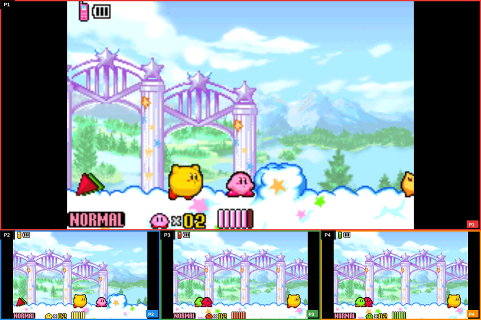 | 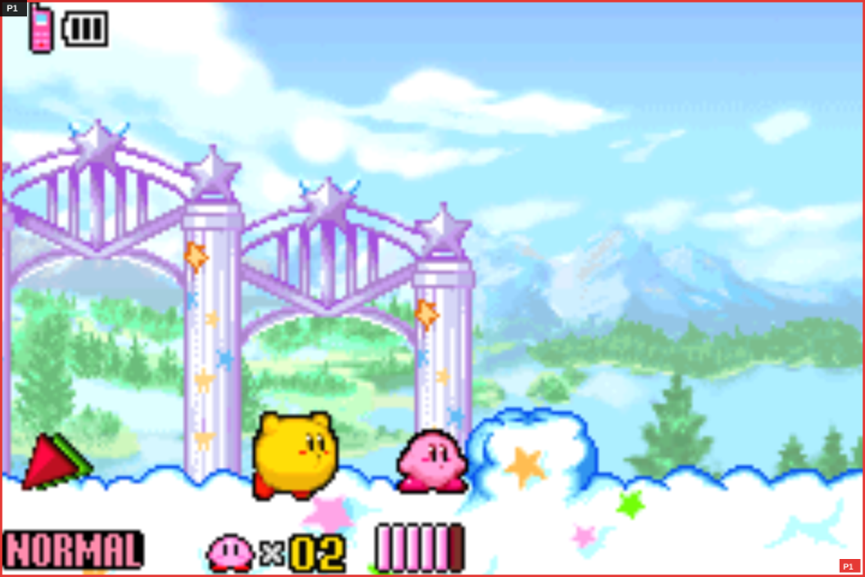 | 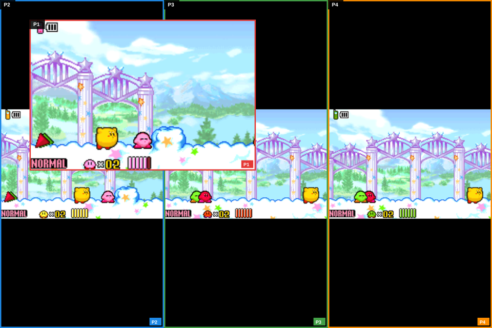 |

**Hide Menu / Full Screen (F11)** drops the menu bar so the game fills the window
(the same session, mid-play):

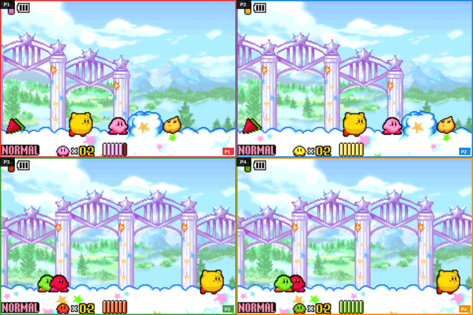

## Architecture

- **`libmgba` (C)** — the mGBA core, compiled as a static library. Does all emulation,
  including the lockstep link-cable driver that keeps instances in lockstep.
- **Rust backend** (`mgba-splitscreen/src-tauri`) — wraps `libmgba` (via `bindgen`), manages the
  emulation instances, runs the frame loop, and serves frames + input over a WebSocket.
- **Frontend** (`mgba-splitscreen/src`) — a lightweight HTML/JS canvas UI that renders each
  instance's screen and maps keyboard/gamepad input to GBA buttons.

The backend and frontend communicate over WebSocket, so the same frontend can be used
both inside the Tauri desktop app and in a plain web browser.

## Features

- **1–4 split-screen players** on one machine, each with its own screen and controls.
  Pick the player count from the **Players** menu or as a step when launching from the
  game library (game → players → start).
- **Virtual link cable**: instances stay in perfect, drop-free synchronization via mGBA's
  lockstep link-cable support — trade and battle across instances just like real hardware.
- **Game library launcher** (**File → Games Library**): Recent games (persisted) plus ROM
  folders you add, with box art (local sibling images or an online fallback) and
  controller/keyboard navigation.
- **Save states**: quick save (F5) / quick load (F7) capture *all* players together;
  both hotkeys are remappable. Battery saves next to a ROM (`game.sav`, `game.sa2`, …)
  are auto-loaded.
- **Controller support** (Gamepad API): controller slot #1 → P1, #2 → P2, etc., with
  per-player button re-mapping and remappable global hotkeys (turbo, save/load, pause)
  — all via **Controls → Remap Hotkeys…**, persisted in the browser.
- **Pause menu**: pausing (Escape) freezes all players at once and pops a
  controller-navigable menu (resume / save / load / players / library / quit ROM).
- **Video-call-style view modes** (**View** menu): Grid, Speaker (1 big + smalls),
  Focus (single screen), and Overlay/PiP, cycled with F8/F9 (remappable). Background
  image, per-player outline toggles, and a toggleable debug log are all in the View menu.
- **Hide menu / full screen** (`F11`, remappable): drops the menu bar (and requests
  real fullscreen where the platform allows) so the game fills the window — the mode
  shown in some screenshots above. `F11` or `Escape` brings the menu back.
- **Turbo mode** (Q): fast-forward past 60 fps for grinding through menus/animations.
- **Save import/export** per instance or as a set across all running instances.
- **Web version**: play fully in the browser with no install. The mGBA core is compiled
  to WebAssembly and runs client-side (all 1–4 linked instances step cooperatively on
  the page), so the
  [GitHub Pages](https://spuds0588.github.io/mgba-splitscreen/) site is a real,
  playable emulator — no server, no download.

## Controls

Per-player layouts are fully remappable (keyboard + gamepad) from **Controls** in the
app, so the tables below are just the defaults.

### Player 1 (left hand cluster)

| GBA button | Key |
|------------|-----|
| D-Pad      | `W` `A` `S` `D` |
| A          | `K` |
| B          | `J` |
| L          | `H` |
| R          | `L` |
| Start      | `Enter` |
| Select     | `Backspace` |

### Player 2 (right hand / arrows cluster)

| GBA button | Key |
|------------|-----|
| D-Pad      | Arrow keys |
| A          | `M` |
| B          | `N` |
| L          | `V` |
| R          | `B` |
| Start      | `P` |
| Select     | `O` |

### Player 3 (`T`/`G`/`F`/`R` cluster) and Player 4 (`I`/`Q`/`C`/`E` cluster)

Defaults are listed in **Help** in the app; every key for every player can be remapped.

### Global hotkeys (remappable)

| Action | Default |
|--------|---------|
| Turbo | `Q` |
| Quick save (all players) | `F5` |
| Quick load (all players) | `F7` |
| Pause / resume (all players) | `Escape` |
| Cycle view mode | `F8` |
| Cycle focus player | `F9` |
| Hide menu / full screen | `F11` |

## Building

The desktop app is a [Tauri](https://tauri.app/) v2 project. Prerequisites:

- Rust toolchain (`cargo`, `rustc`)
- `cmake`, `clang` (for building `libmgba` and generating `bindgen` bindings)
- Tauri v2 system dependencies (WebKitGTK on Linux, etc.)
- Node.js (`npm`) for the Tauri CLI

```bash
cd mgba-splitscreen
npm install
npm run tauri dev        # development run
npm run tauri build      # production build (bundles .deb/.AppImage on Linux, etc.)
```

The first build compiles all of `libmgba` from source, which takes a few minutes and
several GB of RAM; subsequent builds are incremental.

### In-browser (WebAssembly) build

The web version is fully client-side — the mGBA core is compiled to WASM and runs in
the page; no backend is involved, so GitHub Pages (or any static host) can serve it.
Rebuild the engine with `mgba-splitscreen/web/build.sh` (requires the Emscripten SDK; produces
`mgba-splitscreen/web/mgba-splitscreen-web.{js,wasm}`, which are committed and staged alongside
`mgba-splitscreen/src` by the Pages workflow). The desktop app never ships or loads the WASM
engine — it embeds only `mgba-splitscreen/src` and runs the native Rust backend.

### Android (tablets, Chromebooks, Android TV)

The Android app is a thin **Tauri v2 shell around the same WebAssembly engine the web
version uses**, running inside the system WebView. No native emulation core is built for
Android — `build.rs` skips it entirely and the Rust side exposes no commands — so an
Android build takes a couple of minutes instead of cross-compiling the whole emulator
through the NDK. That choice is also what makes it work on a Chromecast or Google TV box:
the system WebView is a platform component, whereas a PWA/Trusted Web Activity needs
Chrome, which Android TV deliberately does not have.

Prerequisites: **JDK 17**, the **Android SDK** (platform 36 + build-tools 36), **NDK 27**,
and the Rust Android targets.

```bash
export JAVA_HOME=/path/to/jdk-17
export ANDROID_HOME=/path/to/android-sdk
export NDK_HOME=$ANDROID_HOME/ndk/27.3.13750724
rustup target add aarch64-linux-android armv7-linux-androideabi x86_64-linux-android i686-linux-android

cd mgba-splitscreen
npm install
npx tauri android init                            # once: generates src-tauri/gen/android
npx tauri android build --target aarch64          # install on a real device or TV
npx tauri android build --debug --target x86_64   # install on an x86_64 emulator
```

The APK lands in `src-tauri/gen/android/app/build/outputs/apk/<abi>/<profile>/`. Note the
inversion of the desktop rule: the desktop bundles **strip** the WASM engine (the native
app must not ship a second emulator), while the Android build **stages** it —
`src-tauri/tauri.android.conf.json` swaps `npm run stage-web-engine` in for
`strip-web-engine`. Because Android is treated as the web build, the `?players=` and
`?rom=` deep links behave there exactly as they do in a browser, which is the practical way
to start a game on a TV that has no keyboard.

Release APKs must be signed by a key declared in `gen/android/keystore.properties`
(gitignored, and intentionally not in this repo). `tauri android build` offers to generate
one; decide on a real distribution key before shipping.

## Play in the browser (web version)

Open **[https://spuds0588.github.io/mgba-splitscreen/](https://spuds0588.github.io/mgba-splitscreen/)**
and you get a complete, playable emulator with **no install and no server**: the mGBA
core is compiled to WebAssembly and runs entirely on your machine, in the tab. The
link cable works exactly like the desktop app — run 2, 3, or 4 linked instances with
the **Players** menu, load a ROM (from the **Games Library** or **File → Load ROM**),
and all players' screens, controls (keyboard + gamepad), save states, audio routing,
and view modes work identically.

You can also self-host the same static site locally (`python3 -m http.server 8090 -d
mgba-splitscreen/src` — copy `mgba-splitscreen/web/mgba-splitscreen-web.{js,wasm}` into `mgba-splitscreen/src/` first, or
run `mgba-splitscreen/web/build.sh`). (A future "hosted multiplayer" mode could relay a host's
frames to remote players over WebRTC — see the roadmap.)

### Deep links (URL parameters)

The web build reads two query parameters, so a shared link can boot straight into a
game and can carry the player count with it:

| Parameter | Meaning |
|---|---|
| `players=N` | Number of linked instances to start, **1-4** (default `2`). |
| `rom=<url>` | Fetch this `.gba` and start it immediately. A relative path resolves against the page. |

```
https://spuds0588.github.io/mgba-splitscreen/?players=4
https://spuds0588.github.io/mgba-splitscreen/?players=2&rom=roms/game.gba
```

The `rom` file is fetched with `fetch()`, so it must be **same-origin** (host it beside
`index.html`) or served from a host that sends permissive CORS headers; a link that
points at someone else's bare file will be refused by the browser. A ROM that cannot be
loaded reports why in the status line and leaves the launcher fully usable. Unknown
parameters are ignored, so `?fsassist=1` (the Four Swords link-assist experiment, off by
default) still composes with these.

## Beta releases

Beta builds are produced from version tags (`vX.Y.Z-beta.N`) by the
[release workflow](.github/workflows/release.yml). It builds and uploads:

| Platform | Artifact |
|----------|----------|
| Linux | `mgba-splitscreen_*.deb` + `mgba-splitscreen_*.AppImage` |
| macOS | `mgba-splitscreen_*.dmg` |
| Windows | `mgba-splitscreen_*.msi` (installer) |
| Web | no artifact needed — the fully in-browser WebAssembly build is always live on GitHub Pages |

The fully playable web version is always live on
[GitHub Pages](https://spuds0588.github.io/mgba-splitscreen/) (auto-deployed from
`master` by [.github/workflows/pages.yml](.github/workflows/pages.yml)).

To cut a beta:

```bash
# bump the version in mgba-splitscreen/src-tauri/tauri.conf.json and mgba-splitscreen/package.json,
# commit, then tag and push (the workflow uploads to a GitHub Release):
git tag v0.1.0-beta.1
git push origin v0.1.0-beta.1
```

To build a platform's bundle locally instead of via CI, run `npm run tauri build` on
that platform (each platform must build its own bundle — no cross-compilation).

## Project status

See [`PROJECT_LOG.md`](PROJECT_LOG.md) for the current state of the project, what's
implemented, and what's in progress. This is kept up to date so future sessions can
pick up where the last one left off.

## License & attribution

mgba-splitscreen's original code is distributed under the same terms as mGBA, the
[Mozilla Public License version 2.0](https://www.mozilla.org/MPL/2.0/).

The emulation core is **mGBA**, Copyright © 2013 – 2026 Jeffrey Pfau.
mGBA is licensed under the [Mozilla Public License version 2.0](https://www.mozilla.org/MPL/2.0/).
A copy of the license is in the distributed [`LICENSE`](LICENSE) file.
See the upstream repository at <https://github.com/mgba-emu/mgba>.

mGBA contains the following third-party libraries:

- [inih](https://github.com/benhoyt/inih), Copyright © 2009 – 2020 Ben Hoyt, BSD 3-clause license.
- [LZMA SDK](http://www.7-zip.org/sdk.html), public domain.
- [MurmurHash3](https://github.com/aappleby/smhasher) implementation by Austin Appleby, public domain.
- [getopt for MSVC](https://github.com/skandhurkat/Getopt-for-Visual-Studio/), public domain.
- [SQLite3](https://www.sqlite.org), public domain.

If you are a game publisher and wish to license mGBA for commercial usage, please email
[licensing@mgba.io](mailto:licensing@mgba.io) for more information.
